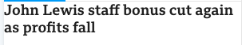
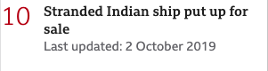

<!-- prettier-ignore -->
# psammead-most-read - [](https://snyk.io/test/github/bbc/psammead?targetFile=packages%2Fcomponents%2Fpsammead-most-read%2Fpackage.json) [](https://david-dm.org/bbc/psammead?path=packages/components/psammead-most-read) [](https://david-dm.org/bbc/psammead?path=packages/components/psammead-most-read&type=peer) [](https://bbc.github.io/psammead/?path=/story/most-read--default-ltr) [](https://github.com/bbc/psammead/blob/latest/LICENSE) [](https://www.npmjs.com/package/@bbc/psammead-most-read) [](https://github.com/bbc/psammead/blob/latest/CONTRIBUTING.md)

## Description

The `MostReadItem` component is designed to display the most read articles given a designated period of time which is dependent on service. The component comprises of a `MostReadTitle`, a `MostReadList` which is a grid containing `MostReadItems`. A `MostReadItem` comprises of a numerical counter representing it's ranking and a link to the article.

## Installation

`npm install @bbc/psammead-most-read/esm/item`

## Props

<!-- prettier-ignore -->
| Argument | Type | Required | Default | Example |
| -------- | ---- | -------- | ------- | ------- |
| item | object | yes | N/A | `{ title: 'This is a item', href: 'https://www.bbc.com' }` |
| count | string | yes | N/A | `'rtl'`  |
| script | object | yes | N/A | `{ canon: { groupA: { fontSize: '28', lineHeight: '32',}, groupB: { fontSize: '32', lineHeight: '36', }, groupD: { fontSize: '44', lineHeight: '48', }, }, trafalgar: { groupA: { fontSize: '20', lineHeight: '24', }, groupB: { fontSize: '24', lineHeight: '28', }, groupD: { fontSize: '32', lineHeight: '36', }, }, }` |
| service | string | yes | N/A | `'news'` |
| dir | string | no | `'ltr'` | `'rtl'`  |
| lastUpdated | node | no | N/A | `<time>12 March 2019</time>` |

## Usage

A typical use-case of this component is as displayed below. It contains a count and an info elements. The info element is a link which point to the corresponding article while the count is a number that represent the position of the info element on the list of info elements.

```jsx
import React from 'react';
import { latin } from '@bbc/gel-foundations/scripts';
import MostReadItem from '@bbc/psammead-most-read/esm/item';

const item = {
    title: 'Cranberries singer O'Riordan died by drowning,
    href: 'https://www.bbc.com'
}

<MostReadItem item={item} script={latin} count="1" service="news" dir="ltr" />;

```
Screenshot




#### <a name="example with last updated date">Example with last updated date</a>


```jsx
import React from 'react';
import { latin } from '@bbc/gel-foundations/scripts';
import Timestamp from '@bbc/psammead-timestamp-container';
import MostReadItem from '@bbc/psammead-most-read/esm/item';

const item = {
    title: 'Cranberries singer O'Riordan died by drowning,
    href: 'https://www.bbc.com'
}

const lastUpdated = (script, service) => (
  <Timestamp
    timestamp={1570031976502}
    dateTimeFormat="YYYY-MM-DD"
    prefix="Last updated: "
    format="LL"
    script={script}
    service={service}
  />
);

<MostReadItem 
    lastUpdated={lastUpdated} 
    item={item} 
    script={latin} 
    count="1" 
    service="news" 
    dir="ltr"
/>;

```

Screenshot



### When to use this component

This component is to be used on `article` pages.

### Accessibility notes

Currently this component is in alpha. This is because it has not yet been tested with various assistive technologies. After it has had an accessibility swarm, this will be published under a standard version.

## Roadmap

Currently, this package only exports the `MostReadItem` component. We will add a wrapper that will export a list of most read components using `@bbc/psammead-grid` to display the most read items on a grid. 

## Contributing

Psammead is completely open source. We are grateful for any contributions, whether they be new components, bug fixes or general improvements. Please see our primary contributing guide which can be found at [the root of the Psammead respository](https://github.com/bbc/psammead/blob/latest/CONTRIBUTING.md).

### [Code of Conduct](https://github.com/bbc/psammead/blob/latest/CODE_OF_CONDUCT.md)

We welcome feedback and help on this work. By participating in this project, you agree to abide by the [code of conduct](https://github.com/bbc/psammead/blob/latest/CODE_OF_CONDUCT.md). Please take a moment to read it.

### License

Psammead is [Apache 2.0 licensed](https://github.com/bbc/psammead/blob/latest/LICENSE).
